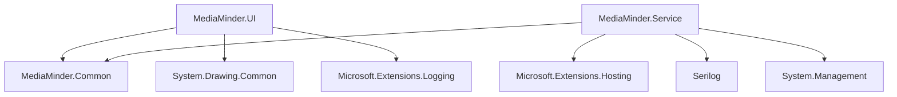

# MediaMinder 开发者文档

## 开发环境设置

### 1. 系统要求
- **操作系统**: Windows 10/11 或 Windows Server 2019/2022
- **开发工具**: Visual Studio 2022 或 Visual Studio Code
- **.NET SDK**: .NET 9.0 SDK
- **Git**: 版本控制工具
- **PowerShell**: 用于脚本执行

### 2. 开发工具安装

#### 2.1 安装.NET 9.0 SDK
```powershell
# 下载并安装.NET 9.0 SDK
# 从 https://dotnet.microsoft.com/download/dotnet/9.0 下载
# 选择 ".NET 9.0 SDK"
```

#### 2.2 安装Visual Studio 2022
```powershell
# 安装Visual Studio 2022 Community/Professional/Enterprise
# 确保安装以下工作负载：
# - .NET 桌面开发
# - Windows 应用开发
# - .NET 跨平台开发
```

#### 2.3 安装Git
```powershell
# 下载并安装Git for Windows
# 从 https://git-scm.com/download/win 下载
```

### 3. 项目设置

#### 3.1 克隆项目
```bash
git clone https://github.com/your-org/MediaMinder.git
cd MediaMinder
```

#### 3.2 还原依赖
```powershell
dotnet restore
```

#### 3.3 构建项目
```powershell
dotnet build
```

## 项目结构详解

### 1. 解决方案结构
```
MediaMinder/
├── MediaMinder.sln                 # 解决方案文件
├── MediaMinder.Common/             # 共享库项目
│   ├── MediaMinder.Common.csproj   # 项目文件
│   ├── ServiceSettings.cs          # 配置模型
│   ├── MessageTypes.cs             # 消息类型
│   ├── PhotoInfo.cs                # 照片信息模型
│   ├── IPCMessage.cs               # IPC消息模型
│   ├── ICommunicationService.cs    # 通信服务接口
│   └── CommunicationProtocol.cs    # 通信协议
├── MediaMinder.Service/            # 后台服务项目
│   ├── MediaMinder.Service.csproj  # 项目文件
│   ├── Program.cs                  # 服务入口点
│   ├── CameraService.cs            # 相机服务
│   ├── PhotoDisplayService.cs      # 照片展示服务
│   ├── NamedPipeCommunicationService.cs # 通信服务
│   └── appsettings.json            # 配置文件
├── MediaMinder.UI/                 # 用户界面项目
│   ├── MediaMinder.UI.csproj       # 项目文件
│   ├── Program.cs                  # UI入口点
│   ├── PhotoDisplayForm.cs         # 主窗体
│   ├── PhotoDisplayForm.Designer.cs # 窗体设计器
│   ├── NamedPipeClient.cs          # 通信客户端
│   ├── ProcessManager.cs           # 进程管理
│   ├── AutoStartManager.cs         # 自动启动管理
│   ├── PhotoBackupCleanupService.cs # 备份清理服务
│   └── PhotoBackupCleanupProcess.cs # 备份清理进程
└── docs/                           # 项目文档
    ├── 项目创建总结.md
    ├── 技术架构文档.md
    ├── 功能特性文档.md
    ├── 部署指南.md
    ├── 用户使用手册.md
    └── 开发者文档.md
```

### 2. 项目依赖关系


## 核心组件开发

### 1. 共享库 (MediaMinder.Common)

#### 1.1 配置模型开发
```csharp
// ServiceSettings.cs
public class ServiceSettings
{
    public CameraServiceSettings CameraService { get; set; } = new();
    public PhotoDisplayServiceSettings PhotoDisplayService { get; set; } = new();
    public CommunicationSettings Communication { get; set; } = new();
}

public class CameraServiceSettings
{
    public bool Enabled { get; set; } = true;
    public string[] CameraDrivePrefixes { get; set; } = Array.Empty<string>();
    public string DcimPath { get; set; } = "DCIM";
    public string TargetDirectory { get; set; } = string.Empty;
    
    public CameraIdentificationSettings Identification { get; set; } = new();
    public ConnectionOptimizationSettings ConnectionOptimization { get; set; } = new();
    public DownloadSettings Download { get; set; } = new();
}
```

#### 1.2 消息类型定义
```csharp
// MessageTypes.cs
public enum MessageType
{
    StatusUpdate,
    NewPhotosAvailable,
    CameraEvent,
    SourceFilesDeleted
}

public enum CameraEventType
{
    DeviceInserted,
    DeviceRemoved,
    CameraIdentified,
    DownloadStarted,
    DownloadCompleted,
    DownloadFailed,
    SourceFilesDeleted
}
```

#### 1.3 数据模型
```csharp
// PhotoInfo.cs
public class PhotoInfo
{
    public string FileName { get; set; } = string.Empty;
    public string FullPath { get; set; } = string.Empty;
    public long FileSize { get; set; }
    public DateTime CreatedTime { get; set; }
    public DateTime ModifiedTime { get; set; }
    public string Extension { get; set; } = string.Empty;
    public bool IsNew { get; set; }
    public string SourceDevice { get; set; } = string.Empty;
}

// IPCMessage.cs
public class IPCMessage
{
    public MessageType Type { get; set; }
    public object? Data { get; set; }
    public string Source { get; set; } = string.Empty;
    public DateTime Timestamp { get; set; } = DateTime.Now;
    
    public static IPCMessage Create(MessageType type, object? data, string source)
    {
        return new IPCMessage { Type = type, Data = data, Source = source };
    }
}
```

### 2. 后台服务 (MediaMinder.Service)

#### 2.1 服务入口点
```csharp
// Program.cs
var builder = Host.CreateApplicationBuilder(args);

// 配置服务
builder.Services.Configure<ServiceSettings>(
    builder.Configuration.GetSection("ServiceSettings"));

// 注册服务
builder.Services.AddSingleton<ICommunicationService, NamedPipeCommunicationService>();
builder.Services.AddSingleton<CameraService>();
builder.Services.AddSingleton<PhotoDisplayService>();

// 配置日志
builder.Services.AddSerilog((services, lc) => lc
    .ReadFrom.Configuration(builder.Configuration)
    .ReadFrom.Services(services));

// 构建并运行
var host = builder.Build();
await host.RunAsync();
```

#### 2.2 相机服务开发
```csharp
// CameraService.cs
public class CameraService : IDisposable
{
    private readonly ILogger<CameraService> _logger;
    private readonly ServiceSettings _settings;
    private readonly ICommunicationService _communicationService;
    private ManagementEventWatcher? _deviceWatcher;
    
    public async Task StartAsync(CancellationToken cancellationToken)
    {
        // 启动设备监控
        StartDeviceMonitoring();
        
        // 发送服务启动消息
        await _communicationService.SendMessageAsync(
            IPCMessage.Create(MessageType.StatusUpdate, "相机服务已启动", "CameraService"));
    }
    
    private void StartDeviceMonitoring()
    {
        var query = new WqlEventQuery("SELECT * FROM Win32_VolumeChangeEvent WHERE EventType = 2");
        _deviceWatcher = new ManagementEventWatcher(query);
        _deviceWatcher.EventArrived += OnDeviceInserted;
        _deviceWatcher.Start();
    }
    
    private async void OnDeviceInserted(object sender, EventArrivedEventArgs e)
    {
        // 处理设备插入事件
        var driveName = e.NewEvent["DriveName"]?.ToString();
        if (string.IsNullOrEmpty(driveName)) return;
        
        // 检查设备插入冷却时间
        if (IsDeviceInCooldown(driveName)) return;
        
        // 检查设备是否在黑名单中
        if (IsDeviceBlacklisted(driveName)) return;
        
        // 等待设备稳定
        await Task.Delay(_settings.CameraService.ConnectionOptimization.DeviceStabilizationDelayMs);
        
        // 识别相机
        if (IsCameraDevice(driveName))
        {
            await DownloadPhotosFromCamera(driveName);
        }
    }
}
```

#### 2.3 照片展示服务开发
```csharp
// PhotoDisplayService.cs
public class PhotoDisplayService : IDisposable
{
    private readonly ILogger<PhotoDisplayService> _logger;
    private readonly ServiceSettings _settings;
    private readonly ICommunicationService _communicationService;
    private FileSystemWatcher? _fileWatcher;
    
    public async Task StartAsync(CancellationToken cancellationToken)
    {
        // 确保照片目录存在
        EnsurePhotosDirectoryExists();
        
        // 启动文件监控
        StartFileMonitoring();
        
        // 发送服务启动消息
        await _communicationService.SendMessageAsync(
            IPCMessage.Create(MessageType.StatusUpdate, "照片展示服务已启动", "PhotoDisplayService"));
    }
    
    private void StartFileMonitoring()
    {
        _fileWatcher = new FileSystemWatcher(_settings.PhotoDisplayService.PhotosDirectory)
        {
            NotifyFilter = NotifyFilters.CreationTime | NotifyFilters.LastWrite | NotifyFilters.FileName,
            IncludeSubdirectories = false,
            EnableRaisingEvents = true
        };
        
        _fileWatcher.Created += OnFileCreated;
        _fileWatcher.Changed += OnFileChanged;
        _fileWatcher.Error += OnFileWatcherError;
    }
    
    private async void OnFileCreated(object sender, FileSystemEventArgs e)
    {
        await HandleFileEvent(e, "文件创建");
    }
    
    private async Task HandleFileEvent(FileSystemEventArgs e, string eventType)
    {
        if (e.FullPath == null) return;
        
        var extension = Path.GetExtension(e.FullPath).ToLowerInvariant();
        if (!_settings.PhotoDisplayService.SupportedExtensions.Contains(extension))
            return;
        
        // 等待文件写入完成
        await Task.Delay(1000);
        
        // 检查文件是否可访问
        if (!IsFileAccessible(e.FullPath)) return;
        
        // 创建照片信息
        var photoInfo = await CreatePhotoInfo(e.FullPath);
        if (photoInfo != null)
        {
            // 发送新照片信息
            await _communicationService.SendMessageAsync(
                IPCMessage.Create(MessageType.NewPhotosAvailable, photoInfo, "PhotoDisplayService"));
        }
    }
}
```

### 3. 用户界面 (MediaMinder.UI)

#### 3.1 主窗体开发
```csharp
// PhotoDisplayForm.cs
public partial class PhotoDisplayForm : Form
{
    private readonly ICommunicationService _communicationService;
    private readonly CommunicationSettings _settings;
    private readonly List<PhotoInfo> _photos = new();
    private readonly List<PictureBox> _pictureBoxes = new();
    private readonly CancellationTokenSource _refreshCancellationTokenSource = new();
    private readonly string _photosDirectory;
    private bool _isDisposed;
    private Button _btnOpenPhotosFolder;
    
    public PhotoDisplayForm()
    {
        InitializeComponent();
        
        // 初始化配置
        _settings = new CommunicationSettings();
        _communicationService = new NamedPipeClient(_settings);
        _photosDirectory = @"C:\ProgramData\MediaMinder\Photos";
        
        // 设置窗体属性
        this.Text = "MediaMinder - 照片展示";
        SetFormSizeToScreenPercentage(0.8);
        this.StartPosition = FormStartPosition.CenterScreen;
        this.FormBorderStyle = FormBorderStyle.Sizable;
        this.MinimumSize = new Size(600, 450);
        
        // 初始化UI
        InitializePhotoDisplay();
        SetupCommunication();
    }
    
    private void InitializePhotoDisplay()
    {
        // 创建滚动面板
        var scrollPanel = new Panel
        {
            Dock = DockStyle.Fill,
            AutoScroll = true,
            Padding = new Padding(10)
        };
        
        // 创建主面板
        var mainPanel = new TableLayoutPanel
        {
            AutoSize = true,
            AutoSizeMode = AutoSizeMode.GrowAndShrink,
            ColumnCount = 3,
            RowCount = 1,
            Padding = new Padding(5)
        };
        
        // 设置列样式
        for (int i = 0; i < 3; i++)
        {
            mainPanel.ColumnStyles.Add(new ColumnStyle(SizeType.Percent, 33.33f));
        }
        
        // 创建按钮
        _btnOpenPhotosFolder = new Button
        {
            Text = "📁 打开照片文件夹",
            Font = new Font("Microsoft YaHei", 10, FontStyle.Regular),
            BackColor = Color.FromArgb(0, 120, 215),
            ForeColor = Color.White,
            FlatStyle = FlatStyle.Flat,
            Dock = DockStyle.Bottom,
            Height = 50,
            Margin = new Padding(5),
            Cursor = Cursors.Hand
        };
        
        _btnOpenPhotosFolder.Click += BtnOpenPhotosFolder_Click;
        
        // 添加控件
        scrollPanel.Controls.Add(mainPanel);
        this.Controls.Add(scrollPanel);
        this.Controls.Add(_btnOpenPhotosFolder);
        
        // 启动照片刷新任务
        _ = Task.Run(async () => await RefreshPhotosAsync(_refreshCancellationTokenSource.Token));
    }
}
```

#### 3.2 备份清理服务开发
```csharp
// PhotoBackupCleanupService.cs
public class PhotoBackupCleanupService
{
    private readonly string _photosDirectory;
    private readonly ILogger<PhotoBackupCleanupService> _logger;
    
    public async Task<bool> ExecuteBackupAndCleanupAsync()
    {
        try
        {
            _logger.LogInformation("开始执行照片备份和清理操作");
            
            // 检查下载目录是否存在
            if (!Directory.Exists(_photosDirectory))
            {
                _logger.LogWarning("照片目录不存在: {PhotosDirectory}", _photosDirectory);
                return true;
            }
            
            // 获取根目录中的所有图片文件
            var imageFiles = GetImageFilesInRootDirectory();
            if (imageFiles.Count == 0)
            {
                _logger.LogInformation("根目录中没有图片文件，跳过备份");
            }
            else
            {
                _logger.LogInformation("找到 {Count} 个图片文件需要备份", imageFiles.Count);
                
                // 创建时间戳命名的子目录
                var backupDirectory = await CreateTimestampedBackupDirectoryAsync();
                if (backupDirectory == null)
                {
                    _logger.LogError("创建备份目录失败");
                    return false;
                }
                
                // 复制文件到备份目录
                var copySuccess = await CopyFilesToBackupDirectoryAsync(imageFiles, backupDirectory);
                if (!copySuccess)
                {
                    _logger.LogError("文件复制失败");
                    return false;
                }
                
                // 验证复制结果
                var verificationSuccess = await VerifyBackupIntegrityAsync(imageFiles, backupDirectory);
                if (!verificationSuccess)
                {
                    _logger.LogError("备份验证失败");
                    return false;
                }
                
                // 删除根目录中的图片文件
                await DeleteRootDirectoryImagesAsync(imageFiles);
            }
            
            // 清理过期子目录
            await CleanupExpiredDirectoriesAsync();
            
            _logger.LogInformation("照片备份和清理操作完成");
            return true;
        }
        catch (Exception ex)
        {
            _logger.LogError(ex, "执行备份和清理操作时发生错误");
            return false;
        }
    }
}
```

## 开发最佳实践

### 1. 代码规范

#### 1.1 命名规范
- **类名**: 使用PascalCase，如`CameraService`
- **方法名**: 使用PascalCase，如`StartAsync`
- **属性名**: 使用PascalCase，如`IsEnabled`
- **字段名**: 使用camelCase，如`_logger`
- **常量名**: 使用PascalCase，如`DefaultTimeout`

#### 1.2 注释规范
```csharp
/// <summary>
/// 相机检测和图片下载服务
/// </summary>
public class CameraService : IDisposable
{
    /// <summary>
    /// 启动相机服务
    /// </summary>
    /// <param name="cancellationToken">取消令牌</param>
    /// <returns>异步任务</returns>
    public async Task StartAsync(CancellationToken cancellationToken)
    {
        // 实现代码
    }
}
```

#### 1.3 异常处理
```csharp
try
{
    // 可能抛出异常的操作
    await SomeAsyncOperation();
}
catch (SpecificException ex)
{
    _logger.LogError(ex, "特定异常处理: {Message}", ex.Message);
    // 特定处理逻辑
}
catch (Exception ex)
{
    _logger.LogError(ex, "未预期的异常: {Message}", ex.Message);
    // 通用处理逻辑
}
```

### 2. 异步编程

#### 2.1 异步方法
```csharp
public async Task<bool> ProcessPhotosAsync(CancellationToken cancellationToken)
{
    try
    {
        // 异步操作
        var photos = await GetPhotosAsync(cancellationToken);
        
        // 并行处理
        var tasks = photos.Select(photo => ProcessPhotoAsync(photo, cancellationToken));
        var results = await Task.WhenAll(tasks);
        
        return results.All(r => r);
    }
    catch (OperationCanceledException)
    {
        _logger.LogInformation("操作被取消");
        return false;
    }
}
```

#### 2.2 取消令牌
```csharp
public async Task LongRunningOperationAsync(CancellationToken cancellationToken)
{
    for (int i = 0; i < 100; i++)
    {
        cancellationToken.ThrowIfCancellationRequested();
        
        // 执行工作
        await DoWorkAsync();
        
        // 定期检查取消
        if (i % 10 == 0)
        {
            cancellationToken.ThrowIfCancellationRequested();
        }
    }
}
```

### 3. 资源管理

#### 3.1 IDisposable实现
```csharp
public class CameraService : IDisposable
{
    private bool _disposed = false;
    private ManagementEventWatcher? _deviceWatcher;
    
    public void Dispose()
    {
        Dispose(true);
        GC.SuppressFinalize(this);
    }
    
    protected virtual void Dispose(bool disposing)
    {
        if (!_disposed)
        {
            if (disposing)
            {
                // 释放托管资源
                _deviceWatcher?.Dispose();
            }
            
            // 释放非托管资源
            _disposed = true;
        }
    }
}
```

#### 3.2 using语句
```csharp
public async Task ProcessFileAsync(string filePath)
{
    using var fileStream = new FileStream(filePath, FileMode.Open, FileAccess.Read);
    using var reader = new StreamReader(fileStream);
    
    var content = await reader.ReadToEndAsync();
    // 处理内容
}
```

### 4. 配置管理

#### 4.1 强类型配置
```csharp
public class CameraServiceSettings
{
    public bool Enabled { get; set; } = true;
    public string[] CameraDrivePrefixes { get; set; } = Array.Empty<string>();
    public string DcimPath { get; set; } = "DCIM";
    public string TargetDirectory { get; set; } = string.Empty;
    
    [Range(1, 300)]
    public int CooldownSeconds { get; set; } = 30;
    
    [Range(1, 10)]
    public int MaxRetryAttempts { get; set; } = 5;
}
```

#### 4.2 配置验证
```csharp
public class CameraService
{
    private readonly CameraServiceSettings _settings;
    
    public CameraService(IOptions<CameraServiceSettings> settings)
    {
        _settings = settings.Value;
        
        // 验证配置
        if (string.IsNullOrEmpty(_settings.TargetDirectory))
        {
            throw new InvalidOperationException("TargetDirectory不能为空");
        }
        
        if (_settings.CameraDrivePrefixes.Length == 0)
        {
            throw new InvalidOperationException("CameraDrivePrefixes不能为空");
        }
    }
}
```

## 测试开发

### 1. 单元测试

#### 1.1 测试项目设置
```xml
<Project Sdk="Microsoft.NET.Sdk">
  <PropertyGroup>
    <TargetFramework>net9.0</TargetFramework>
    <ImplicitUsings>enable</ImplicitUsings>
    <Nullable>enable</Nullable>
    <IsPackable>false</IsPackable>
    <IsTestProject>true</IsTestProject>
  </PropertyGroup>

  <ItemGroup>
    <PackageReference Include="Microsoft.NET.Test.Sdk" Version="17.8.0" />
    <PackageReference Include="xunit" Version="2.6.1" />
    <PackageReference Include="xunit.runner.visualstudio" Version="2.5.3" />
    <PackageReference Include="coverlet.collector" Version="6.0.0" />
    <PackageReference Include="Moq" Version="4.20.69" />
    <PackageReference Include="FluentAssertions" Version="6.12.0" />
  </ItemGroup>
</Project>
```

#### 1.2 测试示例
```csharp
[TestClass]
public class CameraServiceTests
{
    private Mock<ILogger<CameraService>> _mockLogger;
    private Mock<ICommunicationService> _mockCommunicationService;
    private CameraServiceSettings _settings;
    private CameraService _cameraService;
    
    [TestInitialize]
    public void Setup()
    {
        _mockLogger = new Mock<ILogger<CameraService>>();
        _mockCommunicationService = new Mock<ICommunicationService>();
        
        _settings = new CameraServiceSettings
        {
            Enabled = true,
            CameraDrivePrefixes = new[] { "Canon G16", "Nikon" },
            DcimPath = "DCIM",
            TargetDirectory = @"C:\Test\Photos"
        };
        
        _cameraService = new CameraService(
            _mockLogger.Object,
            Options.Create(_settings),
            _mockCommunicationService.Object);
    }
    
    [TestMethod]
    public async Task StartAsync_WhenEnabled_ShouldStartSuccessfully()
    {
        // Arrange
        var cancellationToken = CancellationToken.None;
        
        // Act
        await _cameraService.StartAsync(cancellationToken);
        
        // Assert
        _mockCommunicationService.Verify(
            x => x.SendMessageAsync(It.IsAny<IPCMessage>()),
            Times.Once);
    }
    
    [TestMethod]
    public void IsCameraDevice_WithCanonDrive_ShouldReturnTrue()
    {
        // Arrange
        var driveName = "Canon G16";
        
        // Act
        var result = _cameraService.IsCameraDevice(driveName);
        
        // Assert
        result.Should().BeTrue();
    }
}
```

### 2. 集成测试

#### 2.1 集成测试设置
```csharp
[TestClass]
public class CameraServiceIntegrationTests
{
    private ServiceProvider _serviceProvider;
    private CameraService _cameraService;
    
    [TestInitialize]
    public void Setup()
    {
        var services = new ServiceCollection();
        
        // 配置服务
        services.AddLogging(builder => builder.AddConsole());
        services.AddSingleton<ICommunicationService, NamedPipeCommunicationService>();
        services.AddSingleton<CameraService>();
        
        // 配置设置
        var configuration = new ConfigurationBuilder()
            .AddJsonFile("appsettings.test.json")
            .Build();
        
        services.Configure<ServiceSettings>(configuration.GetSection("ServiceSettings"));
        
        _serviceProvider = services.BuildServiceProvider();
        _cameraService = _serviceProvider.GetRequiredService<CameraService>();
    }
    
    [TestMethod]
    public async Task DownloadPhotosFromCamera_WithValidCamera_ShouldDownloadSuccessfully()
    {
        // Arrange
        var driveName = "E:";
        var cancellationToken = CancellationToken.None;
        
        // Act
        var result = await _cameraService.DownloadPhotosFromCamera(driveName);
        
        // Assert
        result.Should().BeTrue();
    }
}
```

## 调试和诊断

### 1. 日志记录

#### 1.1 结构化日志
```csharp
_logger.LogInformation("开始下载照片: {DriveName}, 文件数量: {FileCount}", 
    driveName, fileCount);

_logger.LogError(ex, "下载照片失败: {DriveName}, 错误: {ErrorMessage}", 
    driveName, ex.Message);

_logger.LogDebug("处理文件: {FileName}, 大小: {FileSize} bytes", 
    fileName, fileSize);
```

#### 1.2 日志配置
```json
{
  "Serilog": {
    "MinimumLevel": {
      "Default": "Information",
      "Override": {
        "Microsoft": "Warning",
        "System": "Warning"
      }
    },
    "WriteTo": [
      {
        "Name": "Console",
        "Args": {
          "outputTemplate": "{Timestamp:HH:mm:ss} [{Level:u3}] {Message:lj}{NewLine}{Exception}"
        }
      },
      {
        "Name": "File",
        "Args": {
          "path": "logs/mediaminder-.log",
          "rollingInterval": "Day",
          "retainedFileCountLimit": 30
        }
      }
    ]
  }
}
```

### 2. 性能监控

#### 2.1 性能计数器
```csharp
public class PerformanceMonitor
{
    private readonly ILogger<PerformanceMonitor> _logger;
    private readonly Stopwatch _stopwatch = new();
    
    public async Task<T> MeasureAsync<T>(Func<Task<T>> operation, string operationName)
    {
        _stopwatch.Restart();
        
        try
        {
            var result = await operation();
            _stopwatch.Stop();
            
            _logger.LogInformation("操作 {OperationName} 完成，耗时: {ElapsedMs}ms", 
                operationName, _stopwatch.ElapsedMilliseconds);
            
            return result;
        }
        catch (Exception ex)
        {
            _stopwatch.Stop();
            _logger.LogError(ex, "操作 {OperationName} 失败，耗时: {ElapsedMs}ms", 
                operationName, _stopwatch.ElapsedMilliseconds);
            throw;
        }
    }
}
```

#### 2.2 内存监控
```csharp
public class MemoryMonitor
{
    private readonly ILogger<MemoryMonitor> _logger;
    
    public void LogMemoryUsage(string context)
    {
        var process = Process.GetCurrentProcess();
        var workingSet = process.WorkingSet64;
        var privateMemory = process.PrivateMemorySize64;
        var gcMemory = GC.GetTotalMemory(false);
        
        _logger.LogInformation("内存使用情况 - {Context}: 工作集={WorkingSet}MB, 私有内存={PrivateMemory}MB, GC内存={GCMemory}MB",
            context,
            workingSet / 1024 / 1024,
            privateMemory / 1024 / 1024,
            gcMemory / 1024 / 1024);
    }
}
```

## 部署和发布

### 1. 发布配置

#### 1.1 发布脚本
```powershell
# publish.ps1
param(
    [string]$Configuration = "Release",
    [string]$OutputPath = ".\publish"
)

Write-Host "开始发布MediaMinder..." -ForegroundColor Green

# 清理输出目录
if (Test-Path $OutputPath) {
    Remove-Item $OutputPath -Recurse -Force
}

# 发布服务
Write-Host "发布MediaMinder.Service..." -ForegroundColor Yellow
dotnet publish MediaMinder.Service -c $Configuration -o "$OutputPath\Service" --self-contained false

# 发布UI
Write-Host "发布MediaMinder.UI..." -ForegroundColor Yellow
dotnet publish MediaMinder.UI -c $Configuration -o "$OutputPath\UI" --self-contained false

# 复制配置文件
Copy-Item "MediaMinder.Service\appsettings.json" "$OutputPath\Service\"
Copy-Item "MediaMinder.UI\appsettings.json" "$OutputPath\UI\" -ErrorAction SilentlyContinue

Write-Host "发布完成！" -ForegroundColor Green
Write-Host "输出目录: $OutputPath" -ForegroundColor Cyan
```

#### 1.2 安装脚本
```powershell
# install.ps1
param(
    [string]$InstallPath = "C:\ProgramData\MediaMinder"
)

Write-Host "开始安装MediaMinder..." -ForegroundColor Green

# 创建安装目录
New-Item -ItemType Directory -Path $InstallPath -Force
New-Item -ItemType Directory -Path "$InstallPath\Photos" -Force
New-Item -ItemType Directory -Path "$InstallPath\Logs" -Force

# 复制文件
Copy-Item ".\publish\Service\*" "$InstallPath\Service\" -Recurse -Force
Copy-Item ".\publish\UI\*" "$InstallPath\UI\" -Recurse -Force

# 安装Windows服务
Write-Host "安装Windows服务..." -ForegroundColor Yellow
sc create "MediaMinder" binPath="$InstallPath\Service\MediaMinder.Service.exe" start=auto
sc description "MediaMinder" "MediaMinder相机照片管理服务"

# 启动服务
sc start "MediaMinder"

Write-Host "安装完成！" -ForegroundColor Green
```

### 2. 版本管理

#### 2.1 版本号管理
```xml
<!-- 在项目文件中设置版本 -->
<PropertyGroup>
  <Version>1.0.0</Version>
  <AssemblyVersion>1.0.0.0</AssemblyVersion>
  <FileVersion>1.0.0.0</FileVersion>
  <InformationalVersion>1.0.0</InformationalVersion>
</PropertyGroup>
```

#### 2.2 发布说明
```markdown
# MediaMinder v1.0.0 发布说明

## 新功能
- 支持34个相机品牌识别
- 自动照片下载和验证
- 智能备份和清理系统
- 自适应照片展示界面
- Photoshop优先打开功能

## 改进
- 优化的连接稳定性
- 改进的错误处理
- 增强的日志记录

## 修复
- 修复了文件句柄占用问题
- 修复了UI响应问题
- 修复了内存泄漏问题

## 系统要求
- Windows 10/11
- .NET 9.0 Runtime
- 4GB RAM (推荐8GB)
- 1GB可用磁盘空间
```

## 贡献指南

### 1. 代码贡献

#### 1.1 分支策略
- **main**: 主分支，用于生产发布
- **develop**: 开发分支，用于集成开发
- **feature/***: 功能分支，用于新功能开发
- **bugfix/***: 修复分支，用于bug修复
- **release/***: 发布分支，用于发布准备

#### 1.2 提交规范
```
<type>(<scope>): <subject>

<body>

<footer>
```

类型说明：
- **feat**: 新功能
- **fix**: bug修复
- **docs**: 文档更新
- **style**: 代码格式调整
- **refactor**: 代码重构
- **test**: 测试相关
- **chore**: 构建过程或辅助工具的变动

#### 1.3 拉取请求
1. Fork项目到个人仓库
2. 创建功能分支
3. 提交代码变更
4. 创建Pull Request
5. 代码审查
6. 合并到主分支

### 2. 问题报告

#### 2.1 问题模板
```markdown
## 问题描述
简要描述遇到的问题

## 重现步骤
1. 步骤1
2. 步骤2
3. 步骤3

## 预期行为
描述预期的行为

## 实际行为
描述实际发生的行为

## 环境信息
- 操作系统: Windows 10/11
- .NET版本: .NET 9.0
- MediaMinder版本: 1.0.0
- 相机品牌: Canon/Nikon/Sony等

## 日志信息
```
粘贴相关的日志信息
```

## 截图
如果适用，请添加截图
```

#### 2.2 功能请求
```markdown
## 功能描述
简要描述请求的功能

## 使用场景
描述这个功能的使用场景

## 预期效果
描述期望的效果

## 替代方案
描述考虑过的替代方案

## 附加信息
任何其他相关信息
```

## 总结

本开发者文档提供了MediaMinder项目的完整开发指南，包括：

1. **开发环境设置**: 开发工具和项目配置
2. **项目结构详解**: 代码组织和依赖关系
3. **核心组件开发**: 主要组件的开发方法
4. **开发最佳实践**: 代码规范和编程模式
5. **测试开发**: 单元测试和集成测试
6. **调试和诊断**: 日志记录和性能监控
7. **部署和发布**: 发布配置和版本管理
8. **贡献指南**: 代码贡献和问题报告

遵循本指南可以确保MediaMinder项目的代码质量和开发效率，为项目的长期维护和扩展提供良好的基础。
