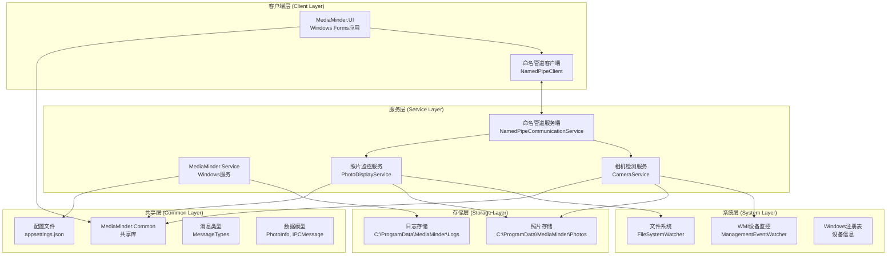
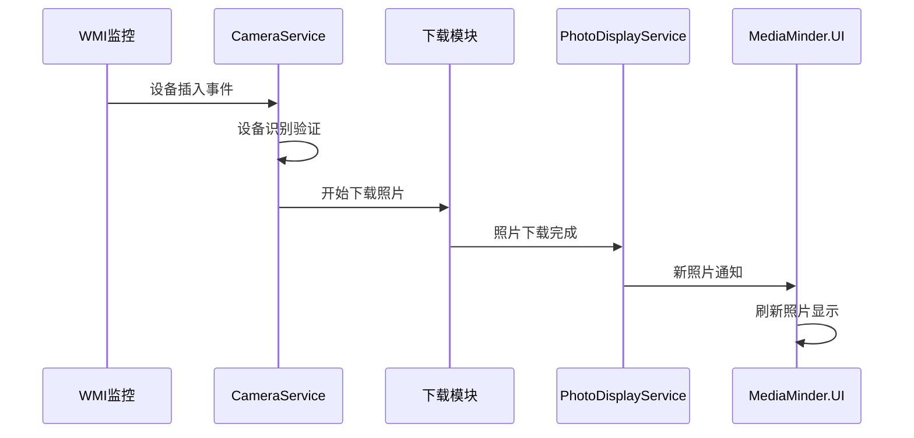
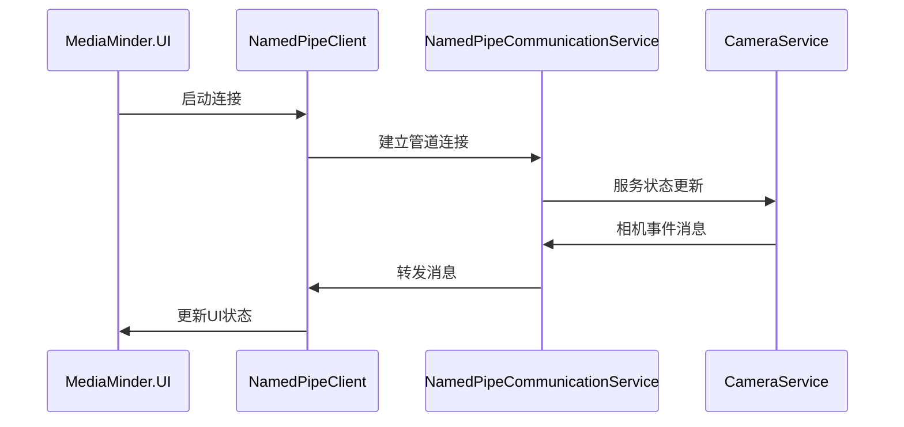
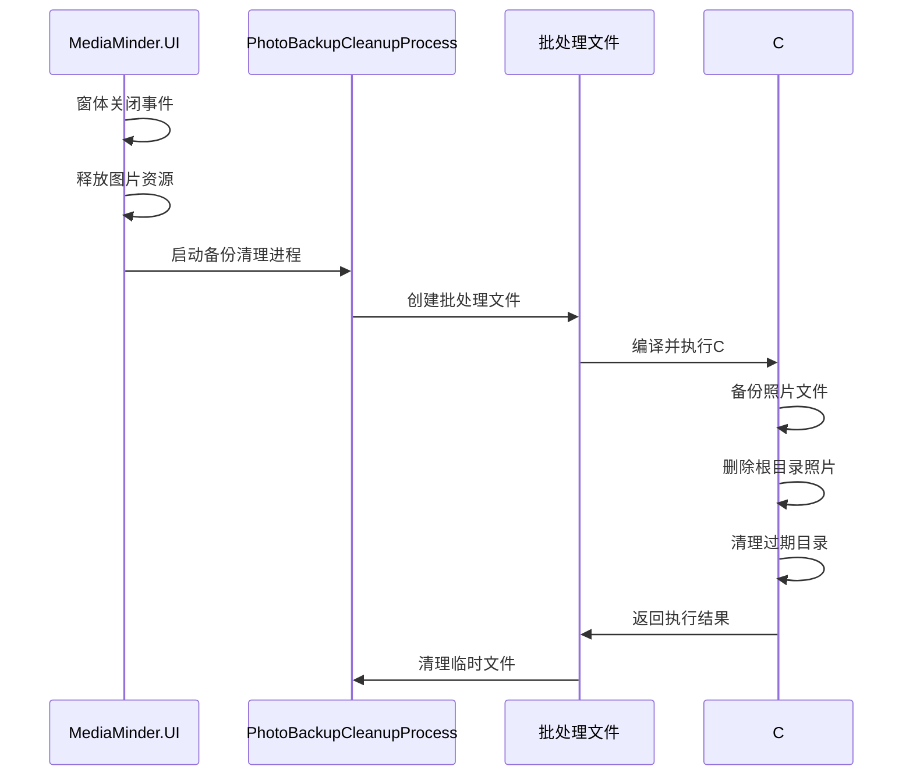

# MediaMinder 技术架构文档

## 架构概述

MediaMinder采用现代化的客户端-服务端（C/S）分离架构，基于.NET 9.0平台构建，具有高可维护性、可扩展性和生产级稳定性。

## 整体架构图



## 项目结构详解

### 1. MediaMinder.Common (共享库)
**目标框架**: .NET Standard 2.0  
**职责**: 定义共享的数据模型、接口和配置

#### 核心组件
- **ServiceSettings.cs**: 强类型配置模型
  - `CameraServiceSettings`: 相机服务配置
  - `PhotoDisplayServiceSettings`: 照片展示服务配置
  - `CommunicationSettings`: 通信配置
- **MessageTypes.cs**: IPC消息类型枚举
- **PhotoInfo.cs**: 照片信息数据模型
- **IPCMessage.cs**: IPC消息数据模型
- **ICommunicationService.cs**: 通信服务接口
- **CommunicationProtocol.cs**: 通信协议定义

### 2. MediaMinder.Service (后台服务)
**目标框架**: .NET 9.0  
**类型**: Windows Worker Service  
**职责**: 相机检测、照片下载、目录监控

#### 核心组件
- **Program.cs**: 服务入口点，配置依赖注入
- **CameraService.cs**: 相机检测和照片下载服务
- **PhotoDisplayService.cs**: 照片目录监控服务
- **NamedPipeCommunicationService.cs**: 命名管道通信服务端

#### 技术特性
- **WMI监控**: 使用`ManagementEventWatcher`监控USB设备插入
- **文件监控**: 使用`FileSystemWatcher`监控照片目录变化
- **异步处理**: 全面使用async/await模式
- **依赖注入**: 使用Microsoft.Extensions.DependencyInjection
- **配置绑定**: 使用IOptions<T>模式绑定配置

### 3. MediaMinder.UI (前台应用)
**目标框架**: .NET 9.0-windows  
**类型**: Windows Forms应用  
**职责**: 用户界面、照片展示、用户交互

#### 核心组件
- **Program.cs**: UI入口点，单实例应用
- **PhotoDisplayForm.cs**: 主照片展示窗体
- **NamedPipeClient.cs**: 命名管道客户端
- **ProcessManager.cs**: 进程管理
- **AutoStartManager.cs**: 自动启动管理
- **PhotoBackupCleanupService.cs**: 备份清理服务
- **PhotoBackupCleanupProcess.cs**: 备份清理进程启动器

#### 技术特性
- **自适应UI**: 屏幕80%尺寸，支持滚动
- **异步加载**: 异步加载图片，不阻塞UI
- **智能打开**: Photoshop优先，降级到默认程序
- **独立进程**: 备份清理使用独立进程避免文件句柄占用

## 数据流架构

### 1. 相机检测流程


### 2. 进程间通信流程


### 3. 备份清理流程


## 配置架构

### 1. 配置层次结构
```
appsettings.json
├── ServiceSettings
│   ├── CameraService
│   │   ├── 基础配置 (Enabled, DcimPath, TargetDirectory)
│   │   ├── Identification (相机识别配置)
│   │   ├── ConnectionOptimization (连接优化配置)
│   │   └── Download (下载行为配置)
│   ├── PhotoDisplayService
│   │   ├── 基础配置 (Enabled, PhotosDirectory)
│   │   └── 显示配置 (MaxThumbnailSize, SupportedExtensions)
│   └── Communication
│       └── 通信配置 (PipeName, TimeoutMs)
├── Logging
│   └── 日志级别配置
└── Serilog
    └── 日志输出配置
```

### 2. 强类型配置绑定
```csharp
// 配置模型定义
public class ServiceSettings
{
    public CameraServiceSettings CameraService { get; set; }
    public PhotoDisplayServiceSettings PhotoDisplayService { get; set; }
    public CommunicationSettings Communication { get; set; }
}

// 依赖注入配置
services.Configure<ServiceSettings>(configuration.GetSection("ServiceSettings"));

// 服务中使用
public CameraService(IOptions<ServiceSettings> settings)
{
    _settings = settings.Value;
}
```

## 通信架构

### 1. 命名管道通信
- **管道名称**: MediaMinder_Pipe
- **通信模式**: 双向异步通信
- **消息格式**: JSON序列化
- **超时处理**: 连接超时5秒，消息超时10秒

### 2. 消息类型定义
```csharp
public enum MessageType
{
    StatusUpdate,           // 状态更新
    NewPhotosAvailable,     // 新照片可用
    CameraEvent,           // 相机事件
    SourceFilesDeleted     // 源文件已删除
}
```

### 3. 消息处理机制
- **异步处理**: 所有消息处理都是异步的
- **错误处理**: 消息处理异常不会影响服务稳定性
- **重连机制**: 连接断开时自动重连
- **消息队列**: 支持消息队列和批量处理

## 存储架构

### 1. 目录结构
```
C:\ProgramData\MediaMinder\
├── Photos\                      # 照片存储根目录
│   ├── IMG_001.jpg             # 根目录照片文件
│   ├── IMG_002.jpg
│   ├── Backup_20241220_143052\  # 备份目录
│   │   ├── IMG_001.jpg
│   │   └── IMG_002.jpg
│   └── Backup_20241219_120000\  # 其他备份目录
├── Logs\                        # 日志目录
│   ├── service-20241220.log     # 服务日志
│   ├── service-20241219.log
│   └── ...
└── Config\                      # 配置目录（可选）
    └── appsettings.json         # 自定义配置
```

### 2. 文件命名规范
- **照片文件**: 保持原始文件名
- **备份目录**: `Backup_yyyyMMdd_HHmmss`
- **日志文件**: `service-yyyyMMdd.log`
- **临时文件**: `MediaMinder_BackupCleanup_yyyyMMdd_HHmmss.*`

### 3. 存储策略
- **照片存储**: 所有照片存储在根目录，便于访问
- **备份策略**: 按时间戳创建备份目录
- **清理策略**: 自动清理超过1周的备份目录
- **日志轮转**: 按天轮转，保留30天

## 安全架构

### 1. 权限管理
- **服务权限**: 以LocalSystem身份运行
- **文件权限**: 使用ProgramData目录，所有用户可访问
- **注册表权限**: 只读访问设备信息
- **网络权限**: 无网络访问需求

### 2. 数据安全
- **文件完整性**: 下载后验证文件大小和哈希
- **备份安全**: 备份文件完整性验证
- **临时文件**: 自动清理所有临时文件
- **日志安全**: 日志文件权限控制

### 3. 异常处理
- **全局异常**: 服务级别的异常捕获
- **资源释放**: 正确的IDisposable实现
- **连接恢复**: 通信连接异常自动恢复
- **文件操作**: 文件操作异常安全处理

## 性能架构

### 1. 内存管理
- **对象池**: 重用PictureBox对象
- **异步加载**: 图片异步加载，不阻塞UI
- **资源释放**: 及时释放图片资源
- **垃圾回收**: 优化GC压力

### 2. 文件操作
- **批量处理**: 批量文件操作
- **异步IO**: 异步文件读写
- **缓存策略**: 智能缓存机制
- **流式处理**: 大文件流式处理

### 3. 并发控制
- **线程安全**: 使用锁和原子操作
- **异步编程**: 全面使用async/await
- **任务调度**: 合理的任务调度策略
- **资源竞争**: 避免资源竞争条件

## 扩展架构

### 1. 插件系统
- **接口定义**: 清晰的插件接口
- **动态加载**: 支持动态加载插件
- **配置驱动**: 通过配置启用插件
- **版本兼容**: 插件版本兼容性

### 2. 配置扩展
- **外部配置**: 支持外部配置文件
- **环境变量**: 支持环境变量覆盖
- **热重载**: 支持配置热重载
- **验证机制**: 配置验证和默认值

### 3. 消息扩展
- **新消息类型**: 易于添加新消息类型
- **消息路由**: 支持消息路由
- **消息过滤**: 支持消息过滤
- **消息转换**: 支持消息格式转换

## 监控架构

### 1. 日志系统
- **结构化日志**: 使用Serilog结构化日志
- **多输出**: 文件日志 + 事件日志
- **日志级别**: 可配置的日志级别
- **日志轮转**: 自动日志轮转和清理

### 2. 性能监控
- **内存监控**: 内存使用情况监控
- **文件监控**: 文件操作性能监控
- **通信监控**: IPC通信性能监控
- **异常监控**: 异常统计和分析

### 3. 健康检查
- **服务状态**: 服务运行状态检查
- **连接状态**: 通信连接状态检查
- **资源状态**: 系统资源状态检查
- **功能状态**: 核心功能状态检查

## 总结

MediaMinder的技术架构具有以下特点：

1. **现代化**: 基于.NET 9.0和最新技术栈
2. **模块化**: 清晰的模块分离和职责划分
3. **可扩展**: 易于扩展和定制
4. **高性能**: 优化的性能和资源使用
5. **高可靠**: 全面的异常处理和恢复机制
6. **易维护**: 清晰的代码结构和文档

这个架构为MediaMinder提供了坚实的技术基础，能够满足生产环境的需求，并为未来的功能扩展提供了良好的支持。
